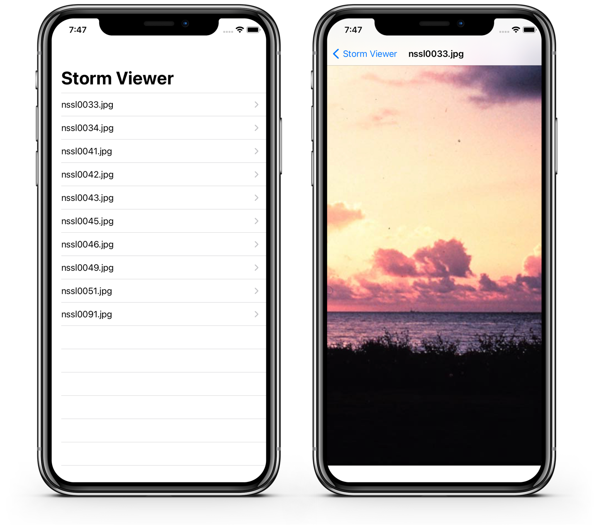

# Project 01 - Storm Viewer 

Learning challenges 100 days of swift [here](https://www.hackingwithswift.com/100/16).

## Topics learning

- ViewController
- TableViewController
- Storyboard 
- FileManager

## Screenshots

<table style="width: 500px;">
  <tbody>
    <tr style="background: #ddd; font-weight: bolder; font-size: 18px">
      <td style="width: 350px; text-align: center;">
          
Projects / Topics

      </td>
      <td style="width: 800px; text-align: center;">
          
Screenshots

      </td>
    </tr>
    <tr>
      <td style="width: 150px;">
        Project 01 Storm Viewer - ViewControllers, Storyboard, FileManager
      </td>
      <td style="width: 250px; padding: 25px;">
        
      </td>
    </tr>
  </tbody>
</table>