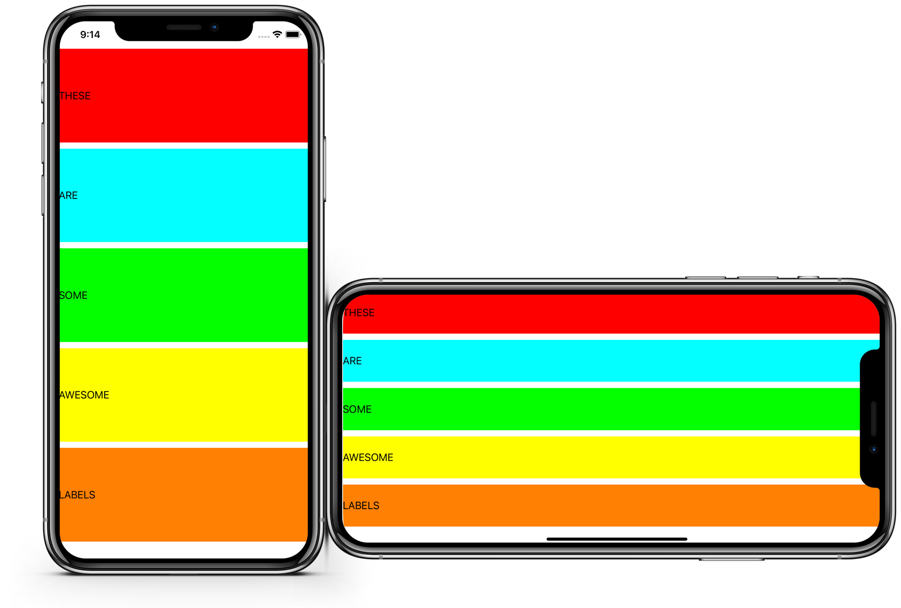

# Project 06 - Auto Layout

https://www.hackingwithswift.com/100/30

Includes solutions to the [challenges](https://www.hackingwithswift.com/read/6/6/wrap-up).

## Topics learning

- NSLayoutConstraint
- Layout anchors
- Visual Format Language

## Screenshots

<table style="width: 500px;">
  <tbody>
    <tr style="background: #ddd; font-weight: bolder; font-size: 18px">
      <td style="width: 350px; text-align: center;">
        Projects / Topics
      </td>
      <td style="width: 800px; text-align: center;">
        Screenshots
      </td>
    </tr>
    <tr>
      <td style="width: 150px;">
        Project 06 - Auto Layout, Constraints, Visual Format Language
      </td>
      <td style="width: 250px; padding: 25px;">
        
      </td>
    </tr>
  </tbody>
</table>