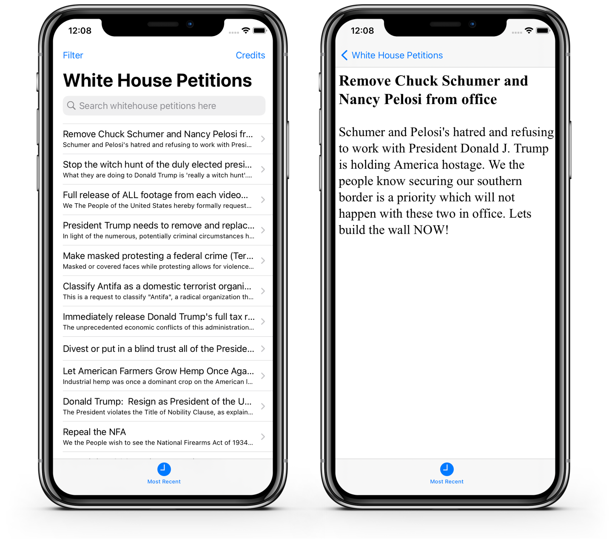

# Project 07 - Whitehouse Petitions

https://www.hackingwithswift.com/100/33

Includes solutions to the [challenges](https://www.hackingwithswift.com/read/7/6/wrap-up)

## Topics covered

- JSON Codable 
- Data 
- UITabBarController

## Additions I have made

- UISearchController

## Screenshoots 

<table style="width: 500px;">
  <tbody>
    <tr style="background: #ddd; font-weight: bolder; font-size: 18px">
      <td style="width: 350px;">
          
&nbsp; &nbsp; Projects / Topics

      </td>
      <td style="width: 800px;">
          
&nbsp; &nbsp; &nbsp; &nbsp; &nbsp; &nbsp; &nbsp;Screenshots

      </td>
    </tr>
    <tr>
      <td style="width: 150px;">&nbsp;
        

          
Project 07 - Whitehouse Petitions (with challenges) UITabBarController, JSON Codable, Data and
            UISearchBarController

        

      </td>
      <td style="width: 250px;">
        

          
&nbsp;
      </td>
    </tr>
  </tbody>
</table>
