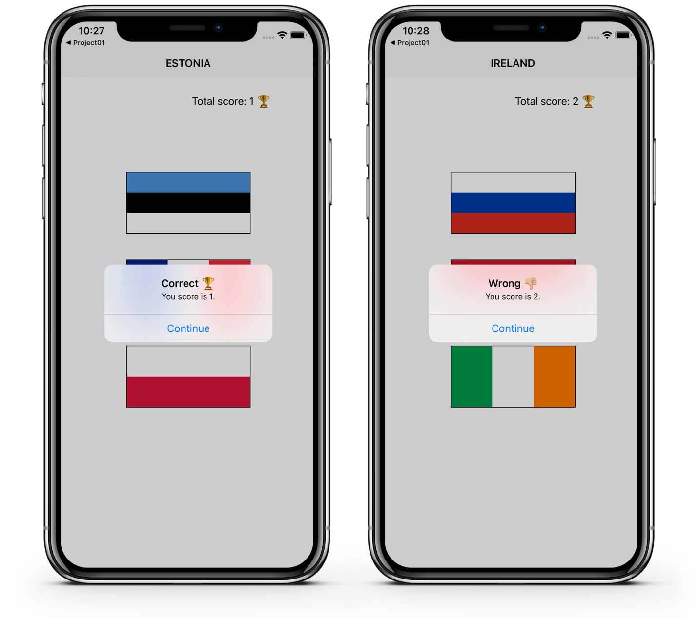
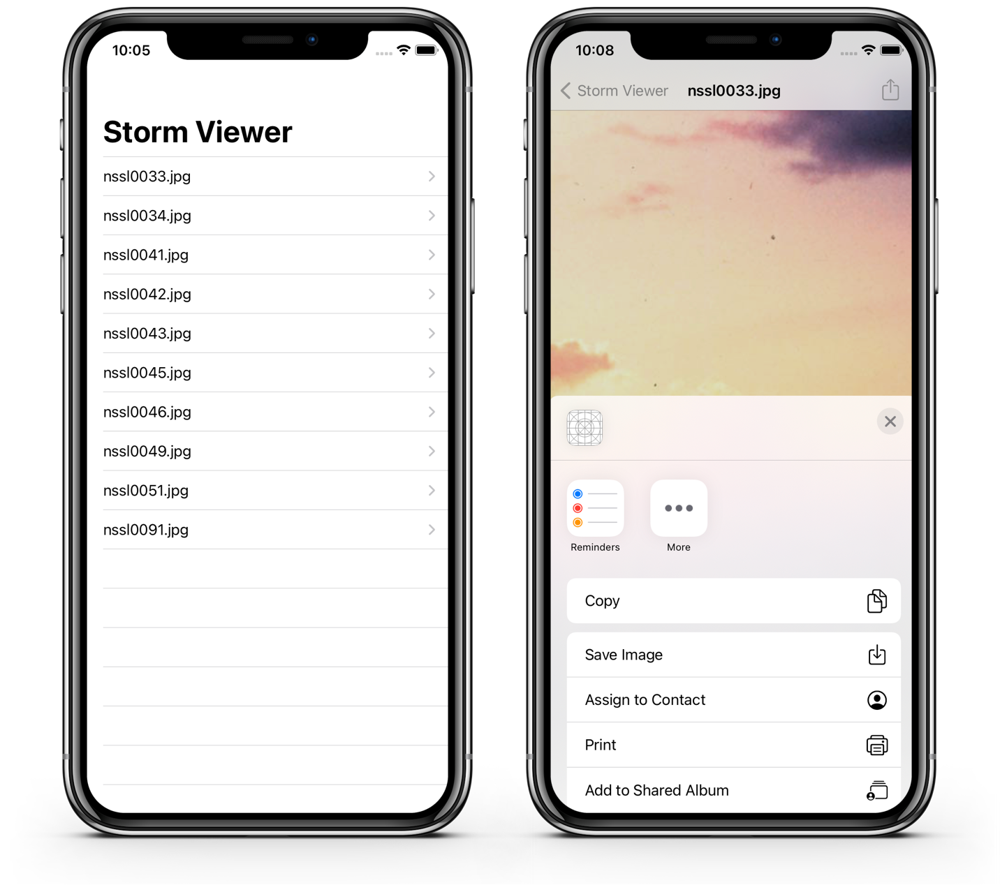
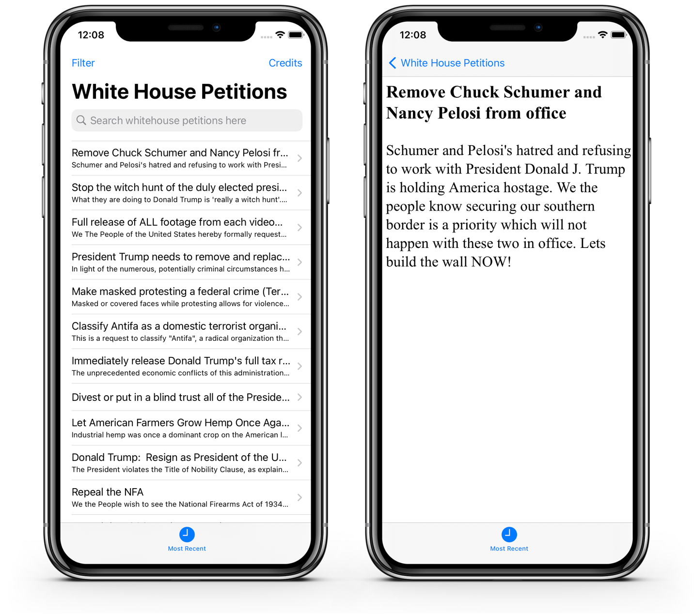

# 100 Days of Swift 

[Original Tutorials @ Hacking With Swift](https://www.hackingwithswift.com/100)

<table style="width: 900px;">
  <tbody>
    <tr style="background: #ddd; font-weight: bolder; font-size: 18px">
      <td style="width: 50%; text-align: center;">
        Projects / Topics
      </td>
      <td style="width: 50%; text-align: center;">
        Screenshots
      </td>
    </tr>
    <!-- Linha Projeto 1 -->
    <tr> 
      <td>
           
          Project 1 
           
          Storm Viewer (with challenges) 
           
          ViewControllers, Storyboard, FileManager
           
      </td>
      <td>
         
        
      </td>
    </tr>
    <!-- Linha Projeto 2 -->
    <tr> 
      <td>
         
        Project 2
         
        Guess the Flag (with challenges) 
          
        UIButton, CALayer, IBAction.
         
      </td>
      <td>
         
        
      </td>
    </tr>
    <!-- Linha Projeto 3 -->
    <tr>
      <td>
         
        Project 3
         
        Social Media (with challenges) 
         
        UIBarButtonItem, UIActivityController.
         
      </td>
      <td>
         
        
      </td>
    </tr>
    <!-- Linha Projeto 7 -->
    <tr>
      <td>
         
        Project 7
         
        Whitehouse Petitions
         
        UITabBarController, JSON Codable, 
         
        Data and UISearchBarController.
         
      </td>
      <td>
         
        
      </td>
    </tr> 
    <!-- Template Nova Linha -->
    <!-- 
    Instruções:
      1. Copie o comentário abaixo e cole após a última linha da tabela.
      2. Troque todos os N pelo número do projeto. 
      3. Coloque o título do projeto no lugar de Lorem Ipsum.
    -->
    <!-- Linha Projeto N -->
    <!-- 
      <tr>
        <td>
           
          Project N
           
          Lorem Ipsum
           
        </td>
        <td>
           
          
        </td>
      </tr> 
    -->
  </tbody>
</table>

---

Feito por <strong>Alley Pereira  👩🏻‍💻 
   

